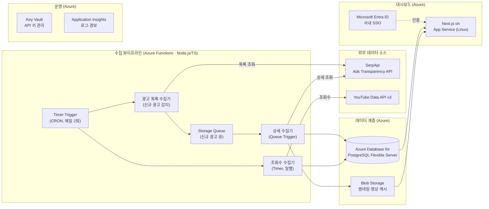

# 구글 광고 레퍼런스 수집 시스템 (Azure)

> 경쟁사 구글 광고 레퍼런스를 자동 수집·정리하고 대시보드로 조회하는 시스템.
> 본 문서는 **설계변경 계획서 v1.1 (Azure 구축안)** 을 기준으로 한 프로젝트 개요이며, 프로젝트의 단일 기준 문서(source of truth) 역할을 한다.

- **기준 문서:** 구글 광고 레퍼런스 수집 시스템 설계변경 계획서 (Azure) v1.1 / 개발 계획서 v1.0 (Supabase+Vercel)
- **작성 기준일:** 2026-07-23
- **인프라:** Microsoft Azure (서버리스 우선 + 관리형 PostgreSQL)
- **리소스 그룹 / 리전:** `rg-adref-prod` / Korea Central
- **진행 방식:** **로컬 우선 구현 → 전체 기능 테스트 완료 → Azure 배포** (아래 0장 참조)
- **현재 진행:** Phase 2 (대시보드 MVP) 구현 — Phase 1(수집 파이프라인) 실 API E2E·Functions 런타임·포이즌 큐 검증 완료. Phase 2 에서 `@adref/dashboard`(Next.js 14) 구축: **경쟁사 온보딩**(도메인→광고주 탐색→등록→수집 연계, §4.5), 레퍼런스 리스트·상세·수집 현황 화면을 로컬 라이브 DB·실 SerpApi 로 검증. 상세는 [TODO.md](./TODO.md). 확정 기술 스택은 [CLAUDE.md](./CLAUDE.md).

---

## 0. 개발 진행 방식 (Local-First → Azure Deploy)

Azure 리소스를 먼저 프로비저닝하지 않고, **로컬 환경에서 전체 파이프라인·대시보드를 구현·검증한 뒤 Azure로 배포**한다. Azure 클라우드 서비스는 로컬에서 에뮬레이터/동등 오픈소스로 대체해 개발하며, 코드는 클라우드 종속을 최소화(환경 변수·추상화 계층)하여 배포 시 설정만 전환한다.

### 단계 흐름
```
[1] 로컬 구현        → 로컬에서 수집기·DB·큐·대시보드 전 기능 개발
[2] 로컬 통합 테스트  → 실제 SerpApi/YouTube 키로 E2E 검증, 테스트 통과
[3] Azure 프로비저닝  → Bicep(IaC)로 리소스 생성 (기능 확정 후)
[4] Azure 배포·검증   → GitHub Actions 배포 → 스테이징 스모크 테스트 → 운영 전환
```

### 로컬 ↔ Azure 대응

| 구성요소 | 로컬 개발 환경 | Azure (배포 대상) |
|----|----|----|
| 수집기 런타임 | Azure Functions Core Tools (`func start`, Node.js 20) | Azure Functions (소비 플랜) |
| 스케줄러 | Functions Timer Trigger 로컬 실행 / 수동 트리거 | Timer Trigger (CRON) |
| 큐 | Azurite (로컬 Storage 에뮬레이터) | Azure Storage Queue |
| 데이터베이스 | 로컬 PostgreSQL (Docker) | PostgreSQL Flexible Server (B1ms) |
| 파일 저장소 | Azurite Blob | Azure Blob Storage |
| 대시보드 | `next dev` (로컬 Next.js) | App Service (Linux) |
| 인증 | 로컬 개발용 우회/목 인증 | Entra ID Easy Auth |
| 시크릿 | `.env` / `local.settings.json` | Key Vault + Managed Identity |
| 모니터링 | 콘솔 로그 | Application Insights |

### 원칙
- **클라우드 종속 최소화:** 큐·스토리지·DB 접근은 환경 변수/설정으로 엔드포인트를 주입, 로컬↔Azure 전환 시 코드 변경 없이 설정만 교체
- **동일 런타임:** 로컬도 Node.js 20 + Functions 런타임을 사용해 배포 시 런타임 차이 제거
- **테스트 게이트:** 로컬 E2E 테스트(수집→저장→대시보드 조회) 전부 통과 전에는 Azure 프로비저닝 착수 금지
- **스키마 일관성:** 로컬 PostgreSQL과 Azure PostgreSQL에 동일 마이그레이션 스크립트 적용

---

## 1. 목표 및 원칙

경쟁사의 구글 **비디오 광고**를 24시간 자동으로 수집하여, 신규 광고 감지 → 영상·게재정보 저장 → 조회수 등 지표 추적까지 상시 운영 서버 없이 자동화한다.

- **수집 스코프: 비디오 광고 전용.** 이미지·텍스트 광고는 대상이 아니다. 목록 수집 단계에서 `format === 'video'` 만 감지·저장한다 (상세 조회 API 호출도 비디오에만 발생 → 쿼터 절감).
- **영상 재생:** 대시보드는 **YouTube 영상만** 임베드 재생. 비-YouTube 영상(googlevideo 스트림)은 URL 이 만료되므로 재생 대신 투명성 센터 원본 링크만 제공. 영상 원본 파일은 저장하지 않는다(URL 만 확보).
- **서버리스 우선:** Azure Functions 소비 플랜으로 상시 서버 없이 스케줄 기반 자동 수집
- **관리형 DB:** Azure Database for PostgreSQL Flexible Server
- **사내 통합:** Microsoft 365 / Entra ID 계정 SSO, 단일 구독으로 비용·권한·보안 정책 통합 관리

### 불변 항목 (v1.0 대비 변경 없음)
- 외부 데이터 소스: **SerpApi (Ads Transparency API)**, **YouTube Data API v3**
- DB 스키마: PostgreSQL 유지
- 수집 파이프라인 로직, 대시보드 기능 명세
- 개발 언어: **TypeScript**

### 변경 범위
- 인프라(호스팅·DB·스케줄러·스토리지·인증·모니터링)만 Azure 서비스로 교체

---

## 2. 기술 스택 / 구성요소 매핑 (v1.0 → Azure)

| 구성요소 | v1.0 (Supabase/Vercel) | Azure 구축안 | 변경 영향 |
|----|----|----|----|
| 스케줄러 | Supabase pg_cron | Azure Functions Timer Trigger (CRON) | 코드 이동만, 로직 동일 |
| 수집기 3종 | Supabase Edge Functions (Deno) | Azure Functions (Node.js 20 / TS, 소비 플랜) | Deno → Node.js 런타임 전환 (코드 대부분 재사용) |
| 수집 큐 | DB 테이블 기반 큐 | Azure Storage Queue + Queue Trigger | 재시도·포이즌 큐 내장 (개선) |
| 데이터베이스 | Supabase PostgreSQL | Azure Database for PostgreSQL Flexible Server (B1ms) | 스키마 무변경, RLS → DB 계정·방화벽 |
| 파일 저장소 | Supabase Storage | Azure Blob Storage (Hot 계층) | SAS 토큰 기반 접근 |
| 대시보드 호스팅 | Vercel (Next.js) | Azure App Service for Linux (Node.js, B1) | Next.js SSR 그대로 배포 |
| 인증 | Supabase Auth (Google OAuth) | Microsoft Entra ID (사내 SSO) | 사내 M365 계정 로그인 (개선) |
| 시크릿 관리 | 환경 변수 | Azure Key Vault + Managed Identity | 키 노출 리스크 감소 (개선) |
| 모니터링 | Supabase 로그 + Slack | Application Insights + Azure Monitor 경보 (+Slack/Teams) | 중앙 로그 (개선) |
| 배포 | Vercel Git 연동 | GitHub Actions → Azure 배포 + Bicep (IaC) | 초기 구축 공수 소폭 증가 |

> **대시보드 호스팅 참고:** Static Web Apps의 Next.js 하이브리드(SSR) 지원은 프리뷰 단계이므로 운영 안정성을 위해 App Service를 채택한다. 정적 페이지로 충분해지면 Static Web Apps(무료 플랜)로 전환해 비용 절감 가능.

---

## 3. 시스템 아키텍처



### Azure 리소스

| Azure 리소스 | SKU/플랜 | 역할 |
|----|----|----|
| Azure Functions | 소비(Consumption), Node.js 20 | Timer로 목록·조회수 주기 수집, Queue Trigger로 상세 수집. 월 100만 실행 무료 한도 내 |
| Storage Account | Standard LRS | Blob(썸네일·영상 캐시) + Queue(신규 광고 큐) + Functions 런타임 저장소 겸용 |
| PostgreSQL Flexible Server | Burstable B1ms (1 vCPU/2GB) + 32GB | 경쟁사·광고·지표·이력 저장. 스키마는 v1.0 그대로 |
| App Service (Linux) | Basic B1 | Next.js 대시보드 SSR 호스팅 |
| Microsoft Entra ID | 무료 계층 | 대시보드 사내 SSO (App Service 인증 통합) |
| Key Vault | Standard | SerpApi·YouTube API 키 보관, Managed Identity로 조회 |
| Application Insights | 종량제 | 수집 실행 로그·실패 경보, API 사용량 커스텀 메트릭 |

---

## 4. 상세 설계

### 4.1 스케줄링·수집 파이프라인
- pg_cron 대신 Functions Timer Trigger의 CRON 표현식으로 주기 정의 (예: `0 0 0,12 * * *` — 1일 2회). 주기 변경은 앱 설정값으로 재배포 없이 조정
- **비디오 광고만 대상:** 목록 조회 결과 중 `format === 'video'` 만 신규 감지·큐 적재. 이미지·텍스트는 무시 → 상세 조회 API 를 비디오에만 써 쿼터를 아낀다
- 신규 광고 감지 시 Storage Queue에 메시지 적재 → Queue Trigger가 상세 수집기를 병렬 실행. 실패 메시지는 자동 재시도(기본 5회) 후 포이즌 큐로 이동. 상세 "결과 없음" 은 목록 데이터만으로 저장(재시도 안 함)
- 멱등 설계(`creative_id` upsert), raw jsonb 보존, 쿼터 가드 유지

### 4.2 데이터베이스
- PostgreSQL 유지 → v1.0 스키마·마이그레이션 스크립트 그대로 사용
- 접근 제어: RLS 대신 애플리케이션 계층 권한 + DB 방화벽(Azure 서비스·사내 IP만 허용). 필요 시 Private Endpoint 격리
- 백업: Flexible Server 자동 백업(기본 7일 보존) 사용

### 4.3 대시보드·인증
- Next.js 앱을 App Service(Linux)에 컨테이너 없이 Node 런타임으로 배포. GitHub Actions로 CI/CD
- App Service 기본 인증(Easy Auth)에 Entra ID 연결 — 로그인 코드 구현 없이 사내 SSO, 접근 허용 그룹으로 사용자 관리

### 4.4 시크릿·모니터링
- SerpApi·YouTube API 키는 Key Vault에 저장, Functions·App Service는 Managed Identity로 참조 — 코드·설정에 키 미노출
- Application Insights에 신규 광고 수·API 호출 수를 커스텀 메트릭으로 기록, 수집 연속 실패·쿼터 80% 도달 시 Azure Monitor 경보 → 이메일/Slack/Teams 통지

### 4.5 경쟁사 온보딩 — 대시보드에서 도메인 입력 → 광고주 ID 자동 탐색 → 수집 연계

대시보드에서 경쟁사를 **도메인으로 입력**하면, 시스템이 Google 광고주 ID(`advertiser_id`)를 자동 탐색해 등록하고, 이후 기존 수집 파이프라인이 자동으로 이어받는다. (요구사항 R1 "경쟁사 리스트 등록/추가/삭제" + "광고주명/도메인 검색 후 ID 확정"의 구현)

**다경쟁사 리스트가 기본:** `competitors` 는 **여러 경쟁사 행을 담는 리스트**다. 온보딩은 도메인을 하나씩 **반복 추가**하는 방식이며(coupang.com → naver.com → …), 수집기 `collectAdList` 는 **활성 경쟁사 전체를 순회**한다. 즉 등록된 모든 경쟁사가 매 주기 자동 수집된다. "경쟁사 관리" 화면에서 전체 리스트를 조회·활성/비활성·삭제한다.

**두 층위의 복수 처리:**
- **경쟁사(회사) 복수** — 서로 다른 도메인을 반복 등록해 리스트를 키운다 (핵심).
- **한 도메인 내 광고주 복수** — 한 회사가 법인·대행사별로 advertiser_id 를 여럿 가질 수 있어(예: tesla.com → Tesla Inc. + 대만법인), 후보 중 원하는 것을 **복수 선택**해 등록한다.

**실측 근거 (2026-07):** SerpApi 는 회사명 검색은 지원하지 않고, `text=<도메인>`(예: `text=coupang.com`) **도메인 검색**만 지원한다. 한 도메인에 **여러 광고주 후보**(본사·해외지사·대행사)가 나오므로, 자동 확정이 아니라 **사용자가 후보 중 선택**하는 단계가 필수다.

**온보딩 흐름 (경쟁사 도메인마다 반복):**
```
[1] 대시보드 입력   → 경쟁사 도메인(+표시명) 입력           ┐
[2] 광고주 탐색     → SerpApi 도메인 검색 → 후보 목록        │ 경쟁사 수만큼
                     {광고주명, advertiser_id, 광고 수, 썸네일} │ 반복
[3] 후보 선택·확정  → 올바른 광고주 선택 (복수 선택: 본사+지사) │ (리스트 누적)
[4] 경쟁사 등록     → competitors 테이블에 행 추가(upsert)    ┘
        ↓
[5] 수집 연계       → collectAdList 가 활성 경쟁사 전체를 매 주기 순회 수집
                     (즉시) "지금 수집" 시 해당 광고주 온디맨드 첫 수집(초기 백필)
```
> 각 경쟁사(도메인)를 하나씩 추가해 리스트를 키운다. 등록된 활성 경쟁사는 모두 자동 수집된다.

**구성요소 추가:**
- **광고주 이름 검색(기본)** — `AdvertiserSearch.searchByName(name)` : Google 투명성 센터의 자동완성(SearchSuggestions) 내부 RPC 로 회사명 → 광고주 후보(id·이름·지역·광고 수). SerpApi 쿼터 미사용. ⚠️ **비공식 엔드포인트** — 브라우저 헤더 필요, 과도한 자동 호출 시 429 로 차단되므로 best-effort(캐시·백오프 권장). 안정 경로는 아래 도메인 검색.
- **광고주 도메인 검색(대안)** — `AdsSource.searchAdvertisersByDomain(domain, region?)` : SerpApi 도메인 검색 응답의 `advertiser_id`·`advertiser` 중복 제거 (호출당 SerpApi 1회, 안정적).
- **대시보드(App Service)** — "경쟁사 추가" 화면: 도메인 입력 → 후보 조회(route handler `POST /api/competitors/search`) → 후보 선택 → 등록(`POST /api/competitors`). 서버 측에서만 SerpApi 키 사용.
- **수집 연계** — 등록 즉시는 기존 `collectAdList`(활성 경쟁사 순회)가 다음 주기에 자동 반영. **즉시 첫 수집**은 온디맨드 트리거로 지원: HTTP 트리거 Function `collectForCompetitor`(단일 광고주 목록 수집→큐 적재)를 대시보드가 호출. (MVP 는 스케줄 자동 반영, 즉시 수집은 후속 개선)

**설계 원칙 유지:** 탐색·등록은 대시보드(쓰기 최소)에서, 실제 수집은 Functions 에서. 도메인당 다광고주 대응(선택 UI)으로 잘못된 ID 등록을 방지한다.

---

## 5. 월 운영 비용 (추정)

| 항목 | v1.0 | Azure 구축안 | 비고 |
|----|----|----|----|
| 데이터 수집 API (SerpApi) | $75 | $75 | 공통 — Developer 플랜 |
| DB | $25 | 약 $15~18 | Azure 소폭 저렴 (B1ms+32GB) |
| 수집 실행 (Functions) | (포함) | 약 $0 | 무료 한도 내 |
| 스토리지·큐 | (포함) | 약 $1~3 | 썸네일 수 GB 기준 |
| 대시보드 호스팅 | $0~20 | 약 $13 | App Service B1 |
| 인증 | $0 | $0 | Entra ID 무료 계층 |
| 모니터링 | $0 | 약 $0~5 | App Insights 종량 |
| YouTube Data API | $0 | $0 | 무료 쿼터 |
| **합계** | **약 $100~120** | **약 $105~115** | **총액 거의 동일** |

- Korea Central 종량제 기준 추정치, 리전·환율에 따라 ±10~20% 변동. 구축 전 Azure Pricing Calculator로 확정
- 1년 이상 운영 확정 시 DB 예약 인스턴스(1년 약정)로 DB 비용 약 30% 추가 절감 가능
- 개발·검증 기간은 Azure 무료 크레딧/Free 계층 + SerpApi Free~Starter로 월 $25 내 운영 가능

---

## 6. 개발 일정 (로컬 우선 → Azure 배포)

| 단계 | 내용 | 환경 | 기간 |
|----|----|----|----|
| Phase 0 — 기술 검증 | SerpApi/YouTube API 데이터 실측·쿼터 확인 | 로컬 | 2~3일 |
| Phase 1 — 수집 파이프라인 | 수집기 3종 + 큐 + DB 저장 (Functions Core Tools, Azurite, 로컬 PG) | 로컬 | 1주 |
| Phase 2 — 대시보드 MVP | Next.js 대시보드 (`next dev`), 로컬 목 인증, **경쟁사 온보딩(도메인→광고주 ID 탐색→등록, §4.5)** | 로컬 | 1~1.5주 |
| **Phase 3 — 로컬 통합 테스트 (게이트)** | 실제 API 키로 E2E 검증, 전체 기능 테스트 통과 | 로컬 | 0.5~1주 |
| **Phase 4 — Azure 프로비저닝** | Bicep(IaC), Functions/DB/Key Vault/App Service 생성, GitHub Actions | Azure | 2~3일 |
| Phase 5 — Azure 배포·안정화 | 스키마 마이그레이션, Easy Auth(Entra ID) 연결, App Insights 경보, 스모크 테스트 | Azure | 0.5~1주 |

**총 개발 기간:** 약 4~5주. 로컬에서 기능을 확정한 뒤 Azure 프로비저닝을 진행하므로, 클라우드 리소스 비용은 통합 테스트 통과 이후에만 발생한다. IaC·배포 파이프라인은 이후 시스템 증설 시 재사용되어 회수.

> **게이트 규칙:** Phase 3(로컬 통합 테스트)의 전체 기능 테스트가 통과되기 전에는 Phase 4(Azure 프로비저닝)에 착수하지 않는다.

---

## 7. 리스크

| 리스크 | 수준 | 대응 |
|----|----|----|
| Functions 소비 플랜 콜드 스타트 | 낮음 | 배치 수집 특성상 영향 미미. 대시보드 API는 App Service라 무관 |
| B1ms DB 성능 한계 | 낮음 | 데이터 규모 작아 충분. 부족 시 B2s 무중단 스케일업 |
| Azure 요금 변동·환율 (원화 결제) | 중간 | 월 예산 경보(Cost Management), 분기별 비용 리뷰 |
| 운영 인력 Azure 경험 필요 | 중간 | Bicep 템플릿·운영 런북 문서화, Azure Portal 단일 창구 |
| v1.0 공통 리스크 (조회수 대체 지표, 랜딩 URL 부분 제공 등) | — | v1.0과 동일, 본 변경의 영향 없음 |

---

## 8. Azure 배포 순서 (Phase 4~5 체크리스트)

> 전제: Phase 3 로컬 통합 테스트 전체 통과.

1. 구독·리소스 그룹 생성 (`rg-adref-prod`, Korea Central), 비용 경보 설정
2. Bicep 템플릿 작성: Storage Account, PostgreSQL Flexible Server, Key Vault, Function App, App Service, Application Insights
3. Key Vault에 SerpApi·YouTube 키 등록, Functions/App Service에 Managed Identity 부여
4. DB 스키마 마이그레이션 적용 (로컬과 동일 스크립트)
5. GitHub Actions 파이프라인 구성 (main 브랜치 → Functions·App Service 자동 배포)
6. Entra ID 앱 등록 및 App Service Easy Auth 연결, 접근 허용 그룹 지정
7. 스테이징 스모크 테스트 (수집→저장→대시보드 조회) 후 운영 전환

---

## 참고 자료

- [Azure Database for PostgreSQL Flexible Server 요금](https://azure.microsoft.com/en-us/pricing/details/postgresql/flexible-server/)
- [Azure Functions 요금 (소비 플랜)](https://azure.microsoft.com/en-us/pricing/details/functions/)
- [Azure App Service 요금](https://azure.microsoft.com/en-us/pricing/details/app-service/linux/)
- [Static Web Apps의 Next.js 하이브리드 지원 (프리뷰)](https://learn.microsoft.com/en-us/azure/static-web-apps/nextjs)
- 기준 문서: 구글 광고 레퍼런스 수집 시스템 개발 계획서 v1.0 / 설계변경 계획서 (Azure) v1.1
